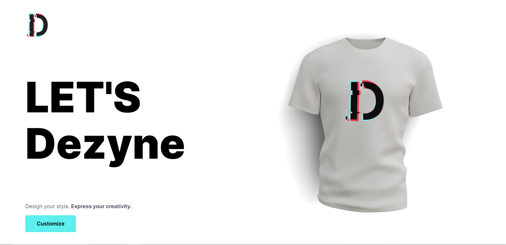
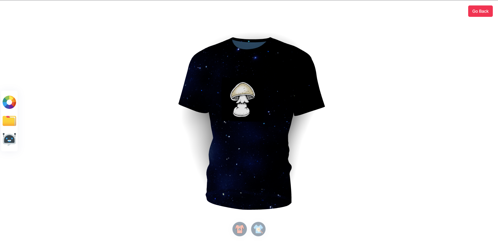

# Dezyne

Author: Tornike Jimshiashvili

Design your style. **Express your creativity.**

Customize your shirts effortlessly with a user-friendly color picker, upload your own logos or patterns for that personal touch, and take it to the next level with our AI-powered logo and pattern generator, making your designs truly one-of-a-kind. Unleash your imagination and bring your fashion dreams to life with ease

## Screenshots




## Getting started

1. Clone the repo

   ```
   git clone https://github.com/tornikej98/Dezyne.git

   cd Dezyne
   ```

2. Install required dependencies

   ```
   cd /client

   npm i
   ```

   ```
   cd /server

   npm i
   ```

3. Start the server

   ```
   cd /server

   nodemon index
   ```

4. Start the client

   ```
   cd /client

   npm run dev

   ```

# Tech Stack

- **Back end**: [Node js](https://nodejs.org/en) & [Express](https://expressjs.com/)

- **Front end**: [React](https://react.dev/), [Vite](https://vitejs.dev/), [Three.js](https://threejs.org/)
- **Styling**: [Tailwind](https://tailwindcss.com/)
